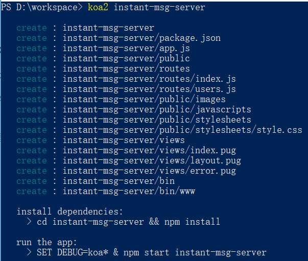
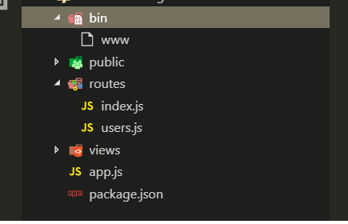
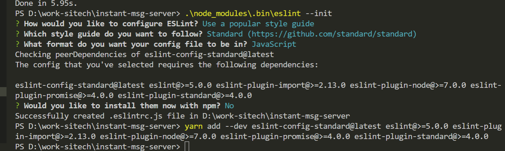
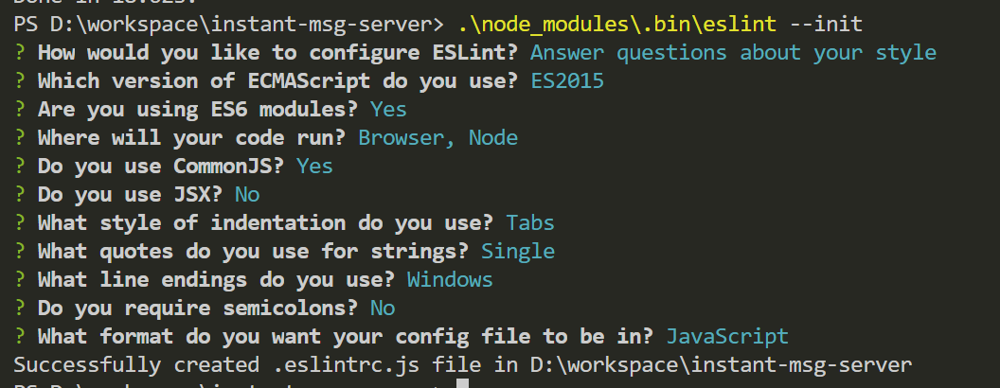

# 工程创建

&emsp;&emsp;工程创建使用 koa 的脚手架工具，自动创建工程并引入基本的依赖、建立相关目录。  
&emsp;&emsp;使用 koa-generator 创建工程，在 koa 工程中加入 socketIO 相关服务

> 1. 先装好 node，现在前端开发必备环境;
> 2. 安装好 yarn，yarn 比自带的 npm 更加优秀（建议使用淘宝镜像）

## 安装

&emsp;&emsp;win+r 键入 cmd 启动命令行，或者 shift+右键在选择 powershell，输入

> npm install -g koa-generator

&emsp;&emsp;安装之后则会在 node 的根目录生成 cmd 格式的脚本文件（我是 windows），则可以在命令行中直接使用命令‘koa’、‘koa2’

&emsp;&emsp;这里不要使用'yarn global add koa-generator'，我发现我使用 yarn 全局安装的一些脚手架的时候<b>无法生成命令行脚本文件</b>

## 创建工程

&emsp;&emsp;在自己的工作空间文件夹中打开命令行，执行

> koa2 instant-msg-server

如图:



生成工程文件如下图:



- bin： 执行文件目录，默认 www 为执行文件，并且脚手架自动生成了相关启动代码。
- public：静态资源目录，如：images、javascripts、stylesheets
- routes：路由目录，相当于 MVC 的 Controller
- views： 视图目录，默认使用的 pug/jade 语法
- app.js：koa2 应用入口

## 初始化依赖

```
  cd instant-msg-server && yarn install
```

&emsp;&emsp;提示用 npm，但是实际使用的是 yarn，以下所有在使用 npm 的地方都尽量使用 yarn 代替，避免同时使用 npm 和 yarn。  
&emsp;&emsp;如下，脚手架生成时是会默认引入并使用的依赖

```
"dependencies": {
    "debug": "^2.6.3",
    "koa": "^2.2.0",
    "koa-bodyparser": "^3.2.0",
    "koa-convert": "^1.2.0",
    "koa-json": "^2.0.2",
    "koa-logger": "^2.0.1",
    "koa-onerror": "^1.2.1",
    "koa-router": "^7.1.1",
    "koa-static": "^3.0.0",
    "koa-views": "^5.2.1",
    "pug": "^2.0.0-rc.1"
  },
  "devDependencies": {
    "nodemon": "^1.8.1"
  }
```

## eslint 使用

&emsp;&emsp;开发过程中仅仅依赖个人良好的代码习惯来编写难免会出现不必要的问题遗漏，这个时候我们就需要通过工具来实现代码规范的校验了。

### 标准化

&emsp;&emsp;这里使用 eslint，执行`yarn add eslint --dev`添加 eslint 依赖。添加依赖后还需要执行 eslint 命令选择相关设置和语法规范。如下图


&emsp;&emsp;注意截图的后半部分，需要手动添加依赖（我没有使用 npm）

### 个性化

&emsp;&emsp;上面的配置选择是一个标准化的选择，如果需要个性化的设置或者必须要的选项，可以如下图通过问答来设置。当然，这个选择配置相当的复杂，如非必要还是别这么折腾。


### ignore

&emsp;&emsp;有些时候需要配置免校验的文件，就需要 ignore 了  
&emsp;&emsp;在根目录下创建文件`.eslintingnore`，设置不需要校验的相关文件路径，例如

```
/build/
/config/
/dist/
/*.js
```

vscode 调试，nodemon 模式需要全局安装 nodemon

koa 的异常处理/异常的继承封装
pm2
