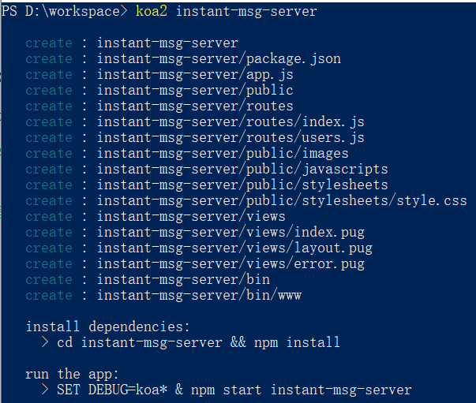

# 工程创建

&emsp;&emsp;使用 koa-generator 创建工程，在 koa 工程中加入 socketIO 相关服务

> 1. 先装好 node，现在前端开发必备环境;
> 2. 安装好 yarn，yarn 比自带的 npm 更加优秀（建议使用淘宝镜像）

## 安装

&emsp;&emsp;win+r 启动命令行，或者 shift+右键在选择 powershell，输入

> npm install -g koa-generator

&emsp;&emsp;安装之后则会在 node 的根目录生成 cmd 格式的脚本文件（我是 windows），则可以在命令行中直接使用命令‘koa’、‘koa2’

&emsp;&emsp;这里不要使用'yarn global add koa-generator'，我发现我使用 yarn 全局安装的一些脚手架的时候<b>无法生成命令行脚本文件</b>

## 创建工程

&emsp;&emsp;在自己的工作空间文件夹中打开命令行，执行

> koa2 instant-msg-server

如图:



生成工程文件如下图:


## 初始化依赖

```
  cd instant-msg-server && yarn install
```

&emsp;&emsp;提示用 npm，但是实际使用的是 yarn，以下所有在使用 npm 的地方都尽量使用 yarn 代替，避免同时使用 npm 和 yarn。


eslint使用
vscode 调试，nodemon 模式需要全局安装 nodemon

koa 的异常处理/异常的继承封装
pm2
