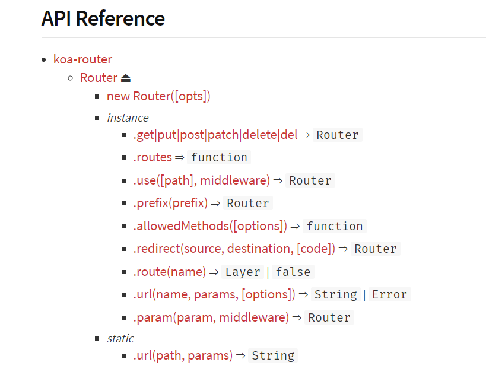

# 工程融合

## koa-router 的使用

&emsp;&emsp;脚手架中已经默认引入了该依赖，并且在`routes/index.js`文件中已经使用`get`形式的示例。koa-router 还有其他的一些功能[参考](https://www.npmjs.com/package/koa-router)



&emsp;&emsp;先在 routes 文件夹中创建 action.js 文件，用于使用 koa-router

### prefixes

&emsp;&emsp;通过这个功能配置 action 的访问路径前置。这个功能很重要，系统的一二级 url 是很重要的资源，很多时候都要担任重要的任务。

```action.js
const action = new Router()
action.prefix('/xxxx/im/server')
// 或者
var action = new Router({
  prefix: '/xxxx/im/server'
})
```

&emsp;&emsp;这样对这个`action`统一配置了前缀，后面在使用的时候就能直径定义后面的路径了。

### post

&emsp;&emsp;和 get 请求类似，使用方式都是一个方法调用的形式。
&emsp;&emsp;ctx 是处理过程中的上下文，封装了 request 和 response。next 是下一个组件。

```action.js
action.post('/msg2Client', (ctx, next) => {
  try {
    logger.info('msg2Client is called')

    let params = ctx.request.body.ROOT.BODY

    ....

  } catch (e) {
    throw new BusiException(e.message)
  }
})
```

## 异常处理

&emsp;&emsp;koa 自带一个`error`事件，这个可以使用它做异常处理和记录。但是我在使用过程中出现无法改写响应结果的问题，debugger 发现似乎在进入这个`error`事件之前响应就回执了，不知道什么原因。

```app.js
// error-handling
app.on('error', (err, ctx) => {
  console.error('server error', err, ctx)
})
```

&emsp;&emsp;所以基于上面原因，使用中间件处理。

```app.js
// 异常处理，获取异常编码和描述，返回给调用者
app.use(async (ctx, next) => {
  try {
    await next()
  } catch (e) {
    logger.logError(ctx, e, '--') // 异常日志
    ctx.body = {
      ROOT: { BODY: { RETURN_CODE: e.code, RETURN_MSG: e.message } }
    }
  }
})
```

## 日志记录

&emsp;&emsp;这里我使用的是 log4js，虽然脚手架自带了 koa-logger，但是我感觉他的功能不够强大，所以又使用了 log4js（后面发现这个改动有点多余，使用 pm2 做管理时，他也能很好的处理日志）。

&emsp;&emsp;加入依赖 `yarn add log4js`。而后在根目录中增加`config/log_config.js`和`utils/log_util.js`

&emsp;&emsp;log_config.js 用于配置日志输出文件相关选项，log_util 用于封装日志处理逻辑。

```log_config.js
var log4js = require('log4js')
var path = require('path')
var fs = require('fs')
var basePath = path.resolve(__dirname, '../logs')

var errorPath = basePath + '/errors/'
var resPath = basePath + '/responses/'
var socketPath = basePath + '/socketIO/'

var errorFilename = errorPath + '/error'
var resFilename = resPath + '/response'
var socketFilename = socketPath + '/socket'

/**
 * 确定目录是否存在，如果不存在则创建目录
 */
var confirmPath = function(pathStr) {
  if (!fs.existsSync(pathStr)) {
    fs.mkdirSync(pathStr)
    console.log('createPath: ' + pathStr)
  }
}
log4js.configure({
  appenders: {
    errorLog: {
      type: 'dateFile', //日志类型
      filename: errorFilename, //日志输出位置
      alwaysIncludePattern: true, //是否总是有后缀名
      pattern: '-yyyy-MM-dd.log' //后缀，每小时创建一个新的日志文件
    },
    responseLog: {
      type: 'dateFile',
      filename: resFilename,
      alwaysIncludePattern: true,
      pattern: '-yyyy-MM-dd.log'
    },
    socketLog: {
      type: 'dateFile',
      filename: socketFilename,
      alwaysIncludePattern: true,
      pattern: '-yyyy-MM-dd.log'
    }
  },
  categories: {
    errorLog: { appenders: ['errorLog'], level: 'error' },
    responseLog: { appenders: ['responseLog'], level: 'info' },
    socketLog: { appenders: ['socketLog'], level: 'info' },
    default: { appenders: ['responseLog', 'errorLog'], level: 'trace' }
  },
  // pm2: true,
  // pm2InstanceVar: 'INSTANCE_ID',
  disableClustering: true
})
//创建log的根目录'logs'
if (basePath) {
  confirmPath(basePath)
  //根据不同的logType创建不同的文件目录
  confirmPath(errorPath)
  confirmPath(resPath)
}

module.exports = log4js
```

```log_util.js
var log4js = require('../config/log_config')

var errorLog = log4js.getLogger('errorLog') // 此处使用category的值
var resLog = log4js.getLogger('responseLog') // 此处使用category的值
var socketLog = log4js.getLogger('socketLog')
let accessLog = log4js.getLogger('responseLog')

var logUtil = {}

logUtil.info = function (msg) {
  console.log(msg)
  accessLog.info(msg)
}
logUtil.socketLog = function (msg) {
  console.log(msg)
  socketLog.info(msg)
}

// 封装错误日志
logUtil.logError = function (ctx, error, resTime) {
  if (ctx && error) {
    errorLog.error(formatError(ctx, error, resTime))
  }
}

// 封装响应日志
logUtil.logResponse = function (ctx, resTime) {
  if (ctx) {
    resLog.info(formatRes(ctx, resTime))
  }
}

// 格式化响应日志
var formatRes = function (ctx, resTime) {
  var logText = ''

  // 响应日志开始
  logText += '\n' + '*************** response log start ***************' + '\n'

  // 添加请求日志
  logText += formatReqLog(ctx.request, resTime)

  // 响应状态码
  logText += 'response status: ' + ctx.status + '\n'

  // 响应内容
  logText += 'response body: ' + '\n' + JSON.stringify(ctx.body) + '\n'

  // 响应日志结束
  logText += '*************** response log end ***************' + '\n'
  console.log(logText)
  return logText
}

// 格式化错误日志
var formatError = function (ctx, err, resTime) {
  var logText = ''

  // 错误信息开始
  logText += '\n' + '*************** error log start ***************' + '\n'

  // 添加请求日志
  logText += formatReqLog(ctx.request, resTime)

  // 错误名称
  logText += 'err name: ' + err.name + '\n'
  // 错误信息
  logText += 'err message: ' + err.message + '\n'
  // 错误详情
  logText += 'err stack: ' + err.stack + '\n'

  // 错误信息结束
  logText += '*************** error log end ***************' + '\n'
  console.log(logText)
  return logText
}

// 格式化请求日志
var formatReqLog = function (req, resTime) {
  var logText = ''

  var method = req.method
  // 访问方法
  logText += 'request method: ' + method + '\n'

  // 请求原始地址
  logText += 'request originalUrl:  ' + req.originalUrl + '\n'

  // 客户端ip
  logText += 'request client ip:  ' + req.ip + '\n'

  // 开始时间
  // var startTime
  // 请求参数
  if (method === 'GET') {
    logText += 'request query:  ' + JSON.stringify(req.query) + '\n'
    // startTime = req.query.requestStartTime;
  } else {
    logText += 'request body: ' + '\n' + JSON.stringify(req.body) + '\n'
    // startTime = req.body.requestStartTime;
  }
  // 服务器响应时间
  logText += 'response time: ' + resTime + '\n'

  return logText
}

module.exports = logUtil
```

<Valine></Valine>
