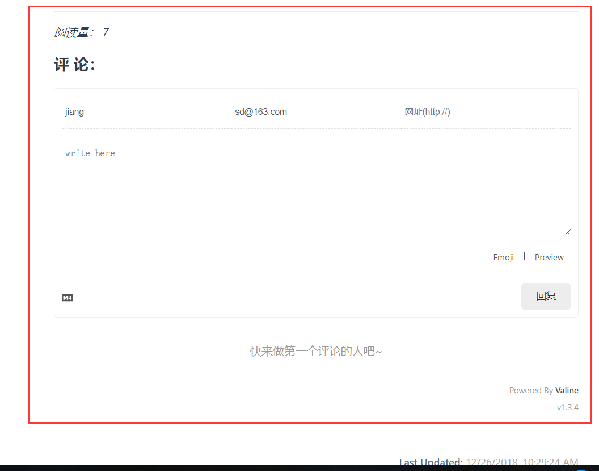
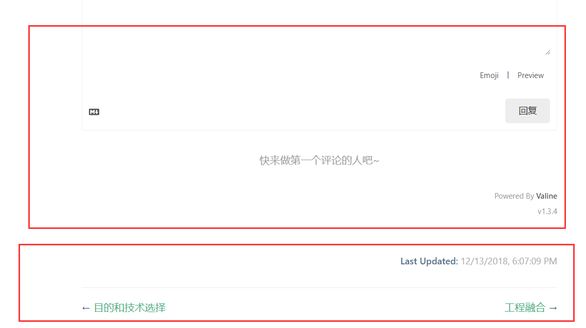
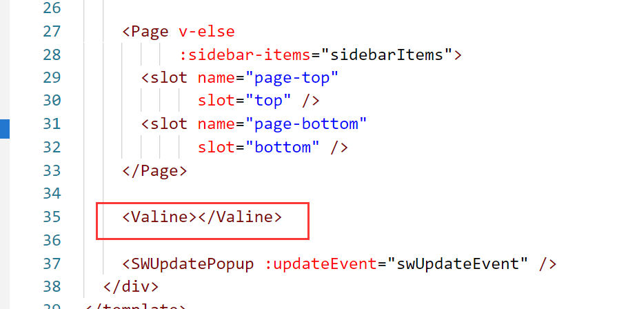
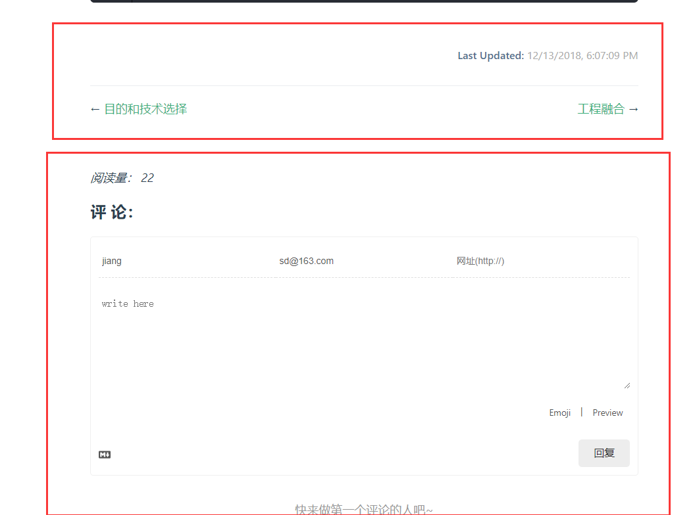

# 评论功能-Valine

&emsp;&emsp;Valine 是一个第三方的评论模块，可用于集成于我们的系统。
[官方网站](https://valine.js.org/)，[网友使用](https://segmentfault.com/a/1190000016144076)

&emsp;&emsp;官方网站更多的侧重在于他们系统的使用和功能，没有用过多的笔墨介绍如何在 vuepress 这样的地方如何集成。而这片网上浏览量较多的博文又语焉不详，不清楚的依然不清楚，了解的也学不到什么。

## 准备工作

### 账号

&emsp;&emsp;使用时需要注册一个账号，可以注册一个开发学习用的账号，基本满足个人使用。下面使用时需要它提供的 appId 和 appKey。

### 依赖

```
# Install leancloud's js-sdk
npm install leancloud-storage --save

# Install valine
npm install valine --save
```

## 1、组件引用

&emsp;&emsp;vuepress 允许自定义组件，如果我定一个组件，在各个 md 文件中引用这个组件。这个组件中实现 Valine 的所需条件，即可以使用了。

### 自定义组件

&emsp;&emsp;`.vuepress/config.js`配置文件中加入

```
 plugins: [
    [
      '@vuepress/register-components',
      {
        componentsDir: './components'
      }
    ]
  ]
```

&emsp;&emsp;这是设置自定义组件的位置。然后在`.vuepress/components`目录中创建文件`Valine.vue`，这是用于自定义自己的 Valine 组件。  
&emsp;&emsp;Valine.vue 的源码如下，这里我开启了阅读量统计。`leancloud-visitors`类所在的元素的 id 会用来识别页面所在位置。

```
<template>
  <section style="border-top: 2px solid #eaecef;padding-top:1rem;margin-top:2rem;">
    <div>
      <!-- id 将作为查询条件 -->
      <span class="leancloud-visitors"
            data-flag-title="Your Article Title">
        <em class="post-meta-item-text">阅读量： </em>
        <i class="leancloud-visitors-count"></i>
      </span>
    </div>
    <h3>
      <a href="javascript:;"></a>
      评 论：
    </h3>
    <div id="vcomments"></div>
  </section>
</template>

<script>
export default {
  name: 'Valine',
  mounted: function () {
    // require window
    const Valine = require('valine');
    if (typeof window !== 'undefined') {
      document.getElementsByClassName('leancloud-visitors')[0].id
        = window.location.pathname
      this.window = window
      window.AV = require('leancloud-storage')
    }

    new Valine({
      el: '#vcomments',
      appId: 'XXXXXXXXXXXXX',// your appId
      appKey: 'XXXXXXXXXXXXX', // your appKey
      notify: false,
      verify: false,
      path: window.location.pathname,
      visitor: true,
      avatar: 'mm',
      placeholder: 'write here'
    });
  },
}
</script>
```

### 使用

&emsp;&emsp;然后在你所写的 md 文件中使用这个标签就行，比如在最下面一行键入

```
  <Valine></Valine>
```

&emsp;&emsp;这样在文章最后就会使用这个组件，如下图。我这里开启了访问量统计功能，这个功能需要去 Valine 的控制台设置。



&emsp;&emsp;这样做会有一个问题，就是评论系统，在页面结构中会被 vuepress 算在“内容”部分，这样会很奇怪。正常的认知评论部分应该在上下章和更新时间下面才对，而且当评论过多时，更为奇怪了。所以我更建议使用下面的方法来引入。


## 2、主题引用

我的目的很简单，通过修改主题的布局，把评论放到下面去。主题形式的修改有一个好处，就是不需要在每一个 md 文件中再重复引用了。

### 修改默认主题

我没有自己重新编写一个主题，就是复制了一下默认主题的内容，进行了修改。默认主题的路径在`node_modules\vuepress\lib\default-theme\Layout.vue`这个位置。在`.vuepress/`目录下创建`theme/`目录，并复制`Layout.vue`文件进行，调整其中所有引用依赖的文件不变，如：

> import Home from './Home.vue'

改为

> import Home from '../../../node_modules/vuepress/lib/default-theme/Home.vue'

这样默认主题就没有任何改变。  
但是我在其中的`Page`组件下方增加了`Valine`组件，如下：

这样我就完成了，在不改变原默认主题的情况下，使评论放在 markdown 内容的下方。

### Valine 调整

上面使其位置达到了，但是由于 dom 位置发生了变化，所以需要调整样式。按我的设想，应该除了样式以外&lt;Valine&gt;组件其他东西不需要调整。如下：

```
<template>
  <div class="page">
    <section class="page-edit">
      <div>
        <!-- id 将作为查询条件 -->
        <span class="leancloud-visitors"
              data-flag-title="Your Article Title">
          <em class="post-meta-item-text">阅读量： </em>
          <i class="leancloud-visitors-count"></i>
        </span>
      </div>
      <h3>
        <a href="javascript:;"></a>
        评 论：
      </h3>
      <div id="vcomments"></div>
    </section>
  </div>
</template>
```

这里用到的 class，都是 vuepress 对 markdown 内容渲染时使用的样式。page，page-edit 都会随屏幕大小变化而变化，复用一下。

效果如下：

但是实际测试发现，这样放在主题中 Valine 组件变成一个公共组件了，不会在每次切换路由时都生成。所以改成监听路由变换时重新初始化数据。

```
<script>
export default {
  name: 'Valine',
  mounted: function () {
    // require window
    const Valine = require('valine');
    if (typeof window !== 'undefined') {
      this.window = window
      window.AV = require('leancloud-storage')
    }
    this.valine = new Valine()
    this.initValine()
  },
  watch: {
    $route (to, from) {
      if (from.path != to.path) {
        this.initValine()
      }
    }
  },
  methods: {
    initValine () {
      let path = location.origin + location.pathname
      // vuepress打包后变成的HTML不知为什么吞掉此处的绑定`:id="countId"`
      document.getElementsByClassName('leancloud-visitors')[0].id = path
      this.valine.init({
        el: '#vcomments',
        appId: 'XXXXXXXXXXXX',// your appId
        appKey: 'XXXXXXXXXXXXX', // your appKey
        notify: false,
        verify: false,
        path: path,
        visitor: true,
        avatar: 'mm',
        placeholder: 'write here'
      });
    }
  }
}
</script>
```
