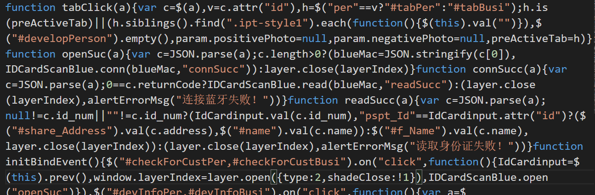

# fis 工程前端业务代码压缩

&emsp;&emsp;目前部门内很多项目使用的是《统一 op 前端开发框架》，该框架的开发工具使用的是百度公司推广的 fis 构建工具。其中就已经集成了 UglifyJS，我们可以直接使用它进行代码混淆。

## UglifyJS 简介

&emsp;&emsp;JS 代码的压缩和代码的混淆可以使得文件变小，还可以有效的防止网站的数据被网络爬虫获取。代码混淆可以把变量名变成 a, b, c 等字母，可以防止爬虫获取到 JS 代码中的 Ajax，从而防止网站数据被他人获取。目前最流行的工具是 UglifyJS2。  
&emsp;&emsp;UglifyJS 是一个 js 解析、混淆、压缩、美化的工具集。[官方文档](https://github.com/mishoo/UglifyJS2)、[UglifyJS 中文文档](https://segmentfault.com/a/1190000008995453)

## 启用混淆功能

&emsp;&emsp;按照《统一 op 开发框架》的规范在启动命令中加入`-o`命令，即可启用压缩混淆功能。  
&emsp;&emsp;但是实际使用时，我发现直接启用是不行的，有些文件会报错。例如国际化的配置文件，虽然此类文件后缀名是`.js`，但是实际上并不是。在使用了 exclude，排除这些文件之后仍然存在其他问题，例如有些插件、文件使用了 es6 的语法，而我们工程并没有使用语法转义。所以直接启用，混淆全部代码是不可行的。  
&emsp;&emsp;这次使用的压缩配置方式，是由<b>程伟</b>提供的。即仅压缩业务代码，忽略其他文件的影响。的确，我们也不需要考虑公共插件，它们与我们的业务没有关系，可以忽略。

### 配置文件修改

&emsp;&emsp;需要调整配置文件，在配置文件中启用`useOptimizer: false`项，以避免非业务代码压缩混淆，例如：

```js
    //基础工程base_op_web_view_o2o/appframe/kernel/require
    {
        reg:/^\/base_op_web_view_o2o\/appframe\/kernel\/(require.*)$/i,
        useHash:false,
        release:'/appframe/kernel/$1',
        useOptimizer: false
    },
```

&emsp;&emsp;该文件 SVN 路径为：[文件路径](http://172.16.9.106:9001/svn/CRMCUI_RD/02%20%E6%BA%90%E4%BB%A3%E7%A0%81/o2o/conf-o2o/fis-conf-prd.js)

### 修改启动命令

&emsp;&emsp;正常开发过程中我们启动 fis 构建工具的命令项是`-cmwL`，生产发布为`-cm`，现在将生成发布改为`-cmo`。例如：

```
fis release -r %fis_workspapce_path% -f %fis_workspapce_path%\conf-o2o\fis-conf-prd.js -d %fis_workspapce_path%\o2orelease -cmo
```

## 效果

&emsp;&emsp;压缩前生产发布的代码如下，以`addShareStaff.js`为例。可见，使用的代码是格式清晰，逻辑可寻，便于读取的。这相当于完全的将我们的业务代码逻辑暴露出来了。

```
var staffId = sessionStorage.getItem("staffId");
var staffName = sessionStorage.getItem("staffName");
var staffPhone = sessionStorage.getItem("staffPhone");

var param = {};
param.positivePhoto;
param.negativePhoto;

var perFlag = true;//个人首次访问标识
var busiFlag =true;//商户首次访问标识
var preActiveTab = $("#tabPer");//上个显示的tab
param["parentStaffId"] = staffId;

//发展人编码
var devCode = "";
//发展人名称
var devName = "";
//渠道编码
var channelCode = "";
```

&emsp;&emsp;混淆压缩后的代码如下，同样以`addShareStaff.js`为例。这里是代码中的一个片段，由这段代码可以看出，代码已经完全失去了原有的清晰感。  
&emsp;&emsp;相信这样的代码已经足够混乱了，正常的读取和识别已经非常难了。



<Valine></Valine>
